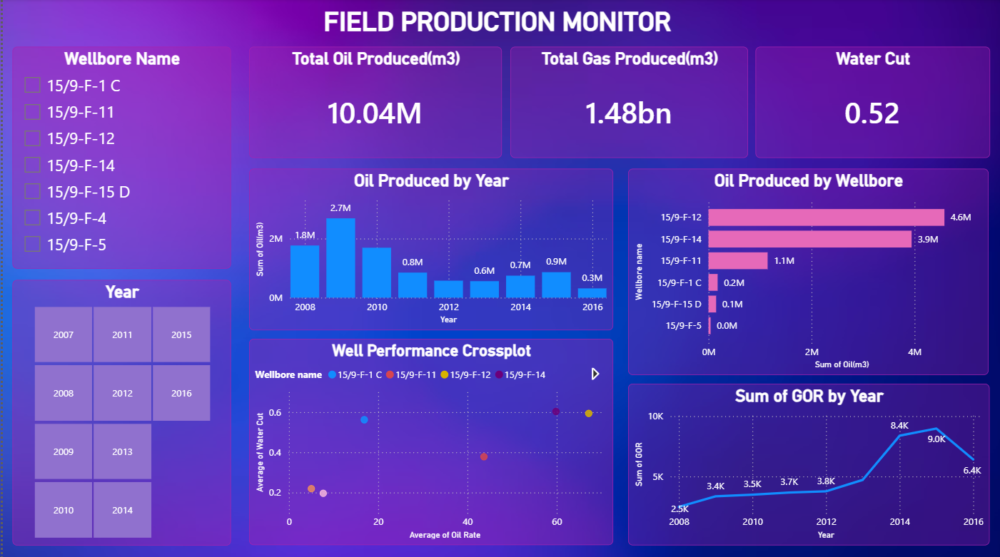

# Oilfield Production Monitor & Reservoir Analytics

## Overview
This project provides a comprehensive analysis of oil and gas production data, combining robust SQL-based data extraction with a visual dashboard to monitor field health, well performance, and economic limits. It is designed to bridge technical computing with reservoir engineering, providing actionable insights for production optimization and diagnostic analysis.

## Dashboard: Field Production Monitor

The interactive dashboard visualizes key performance indicators (KPIs) and production trends between 2007 and 2016. Key metrics include:
* **Total Oil Produced**: 10.04M m³
* **Total Gas Produced**: 1.48bn m³
* **Average Water Cut**: 0.52

### Key Visualizations:
* **Oil Produced by Year & Wellbore**: Highlights top-performing wells (e.g., 15/9-F-12 and 15/9-F-14) and historical production peaks.
* **Well Performance Crossplot**: Analyzes the relationship between Average Water Cut and Oil Rate to evaluate individual well health.
* **Sum of GOR by Year**: Tracks the Gas-Oil Ratio over time to monitor potential gas coning or overall reservoir depletion trends.

## SQL Analytics Engine
The backend analysis is powered by a MySQL database (`Petro`), utilizing a structured `data` table containing monthly wellbore production metrics (Oil, Gas, Water, Onstream days, Rates, and GOR).

The SQL script includes six key analytical queries:
1. **Field-Level Yearly Production & Depletion Trends**: Aggregates total field production and average water cut per year.
2. **Well Ranking by Ultimate Recovery & Uptime**: Ranks wellbores based on cumulative oil production and lifetime water cut.
3. **Identifying High-Risk Wells**: Flags wells with early water breakthrough (>85% water cut) or gas coning (GOR > 250).
4. **Month-over-Month Production Decline**: Calculates percentage changes in oil rate to prepare for Rate Transient Analysis (RTA).
5. **Operational Downtime Audit**: Identifies wells with low active flowing days (onstream < 10 days) per month.
6. **The "Water-Out" Alarm**: Categorizes wells crossing economic limits into 'WARNING' (>90%) and 'CRITICAL' (>95%) statuses based on water cut.

## Setup Instructions
1. Ensure MySQL Server is installed.
2. Create the `Petro` database and `data` table using the provided schema.
3. Update the `LOAD DATA INFILE` path (`C:/ProgramData/MySQL/MySQL Server 8.0/Uploads/DataSet.csv`) to point to your local `DataSet.csv` directory if necessary.
4. Execute the SQL script to populate the database and run the analytical queries.
